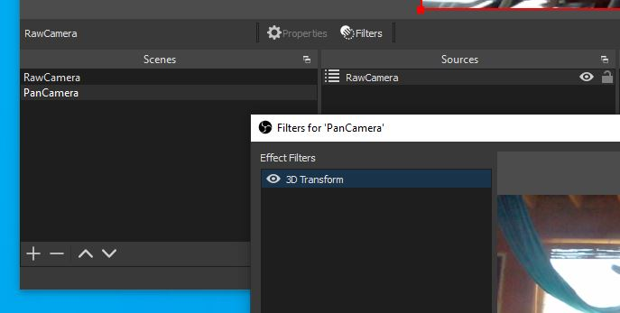
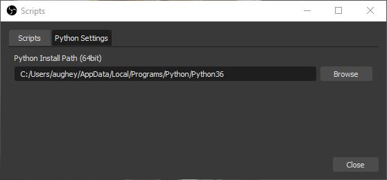
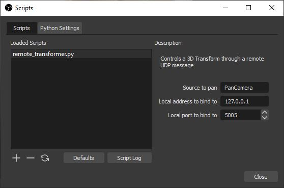

# Virtual Pan/Tilt remote control for OBS sources

These scripts allow an operator to use a gamepad to virtually pan 
and zoom an OBS source as if they were controlling a remote pan/tilt/zoom 
(PTZ) servo.  This was written to give the appearance of a camera with a live operator,
where the camera is actually fix-mounted in an inaccessible location.  

It is
important to note that in order to not degrade the resulting stream, the camera
and OBS Base Canvas resolutions should be greater than the final output resolution.
In my configuration, I am using a 4K camera and the output stream is
1080p.  This makes it possible to "zoom" into the 4K image without losing quality.

It is also important to note that this does a full perspective transformation of the
view and not a Pan and Scan or Windowing type crop.  This eliminates any uneasy
visual distortion effects due to asymetric view frustums. 

# Configuration

There are three parts to this system.

* StreamFX Transform 3D filter: This filter is applied to the source that you wish to control.
* remote_transformer.py: This is a script that is added to Tools -> Scripts.
* gamepad_controller.py: This is a python script run from the command line to read the gamepad and mimic a pan/tilt servo.

## StreamFX - Transform 3D Filter

The first thing to do is to add the Transform 3D filter from the [StreamFX plugin](https://obsproject.com/forum/resources/streamfx-for-obs-studio.578/)
 to the source that you wish to control.


In my case, my scene setup looks like this

Scenes     | Sources
-----------|---------
RawCamera  | Z-Cam
PanCamera  | RawCamera (scene)

I applied the 3D Transform to the PanCamera scene by right clicking on the PanCamera Scene and choosing filters.  The reason
for applying the filter to the scene and not the camera itself is so that I can have a source with raw unpanned camera feed.

## Remote Transformer Script

The next step is to add the remote transformer to Tools -> Scripts in OBS.  Open this window by going to Tools -> Scripts.  Make sure that the Python Settings tab is setup with your installation of Python version 3.6.



In the Scripts tab, click the + button, navigate to where you've extracted this project, and choose 
remote_transformer.py inside the obs_script directory.



There are several options in this script.

* Source to pan - This is the name of the source you wish to apply this script to.  In my case it is the scene name PanCamera because the filter is applied to that scene (scenes are also sources in OBS).
* Local address - This is the IP address we will bind to when listening for remote commands.  Typically you want to keep it to be 127.0.0.1 unless you have a second computer that is running the gamepad software.
* Local port - This is the port number to bind to.  You could have multiple sources that are controllable through unique port numbers.

## Gamepad Controller

The final piece of the puzzle is the gamepad controller.  This is a program which reads the gamepad, simulates a pan/tilt devices, computes the transformations needed to control the view, and communicates with the remote_transformer.py script running inside of OBS.

### Dependencies

This final script only has one dependency and that is the [inputs module](https://pypi.org/project/inputs/).  This can be installed by running `pip install inputs` on the command line.

### Usage

Simply running `python gamepad_controller.py` should work with the default configuration.  This will communicate with OBS on the same
computer to port 5005.  The right thumbstick controls the view and the right and left triggers control zoom.

### Arguments

```
usage: gamepad_controller.py [-h] [--remotehost REMOTEHOST] [--remoteport REMOTEPORT] [--horizontalfov HORIZONTALFOV]
                             [--downangle DOWNANGLE] [--max_zoom_ratio MAX_ZOOM_RATIO] [--pan_limit PAN_LIMIT]
                             [--tilt_limit TILT_LIMIT]

Joystick to OBS Transform 3D controller

optional arguments:
  -h, --help            show this help message and exit
  --remotehost REMOTEHOST
                        Remote OBS host (default 127.0.0.1)
  --remoteport REMOTEPORT
                        Remote OBS port number (default 5005)
  --horizontalfov HORIZONTALFOV
                        Full horizontal field of view (default 90)
  --downangle DOWNANGLE
                        Angle camera is pointed down from level (default 0)
  --max_zoom_ratio MAX_ZOOM_RATIO
                        Maximum zoom ratio. 2 will allow zoom of 2 times
  --pan_limit PAN_LIMIT
                        Limit of the pan motion (default 45 degrees) [symetric]
  --tilt_limit TILT_LIMIT
                        Limit of the tilt motion (default 45 degrees) [symetric]
```

# Additional Notes

All of the arguments to gamepad_controller.py are important for giving an aesthetically pleasing
viewing experience.  In particular, the `horizontalfov` and the `downangle`

## Horizontal FOV

This should be a reasonably accurate estimate of your camera's left to right field of view.  This
is more important for wide angle cameras.  When set incorrectly, panning to an extreme corner of the
view will show an oddly distorted view of the scene.  A Pan & Scan crop is the extreme case.

## Down Angle

If the camera is mounted above and points down (auditorium or CCTV like mounting), the down angle
should be set so that the panning motions "feel" right to the viewer.  